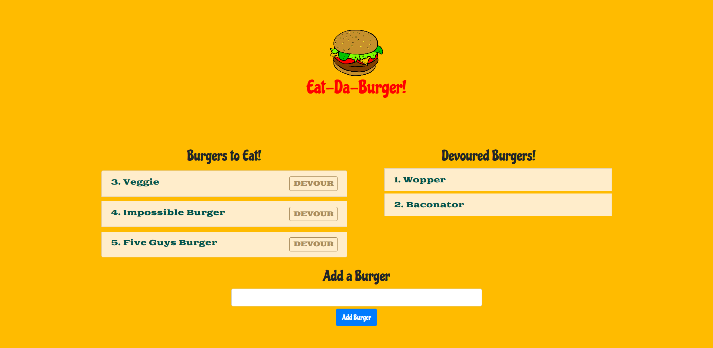

# Burger Logger

## Description

This project showcases the Model, View, and Controller (MVC) design for a burger resturant application. This application allows users to input the type of burger they want to eat and then press a button to "devour" that burger.

The application utilizes Node.js and MySQL to query and route data between the database and application, and Handlebars to generate the HTML front-end.

## Table of Contents

- [Description](#description)
- [Application Screenshot](#application-screenshot)
- [Installation](#installation)
- [Usage](#usage)

## Application Screenshot

_Screenshot of the Burger Application_

_Gif of the application features_

## Installation

There is no installation required for this application as it is hosted on Heroku at the following link: [Eat-Da-Burger](https://quiet-fortress-08480.herokuapp.com/).

The project files for this application can be found on my GitHub Repository at [ntch2000/burger](https://github.com/ntch2000/burger).

## Usage

To use this application, users can go to the deployed heroku application at [Eat-Da-Burger](https://quiet-fortress-08480.herokuapp.com/).

Once the application loads, enter the name of any burger you want to "devour" in the text box at the bottom of the screen. The burger will then be added to the "Burgers to Eat!" list. Users can then click the "Devour" button and the burger will moved to the "Devoured Burgers" list.
